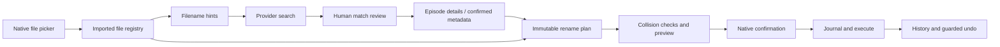

# Architecture

## Product boundary

Desktop first, movies and TV, explicit match review, then safe preview and apply. Local files remain authoritative. Metadata providers supply candidates; they never initiate writes. This initial implementation is independent of FileBot and tinyMediaManager.

The referenced [FileBot fork's license](https://github.com/mobeigi/filebot/blob/master/LICENSE.md) includes a restriction concerning competing clones. No FileBot source, algorithms, UI assets, or binaries were copied into this project. The license was reviewed to decide against code reuse. Similar user-facing workflows do not require using that implementation.

## Components

| Layer                 | Responsibility                                                                                                |
| --------------------- | ------------------------------------------------------------------------------------------------------------- |
| `src/`                | Vue interface: one store, four pages (Review, Preview, History, Settings) built on a shared split view         |
| `desktop/main.ts`     | Native dialogs, saved settings, keychain-encrypted token, IPC sender checks; owns the session                  |
| `desktop/preload.cjs` | Narrow named commands exposed across context isolation                                                        |
| `core/parse.ts`       | Filename and folder hints: titles, years, season/episode, multi-episode ranges, absolute numbers, extras      |
| `core/group.ts`       | Grouping files by show or movie; ranking provider candidates and deciding when a match needs review           |
| `core/animeMap.ts`    | Downloads, validates, and caches the community list that places Kitsu entries in TMDB and TVDB seasons          |
| `core/session.ts`     | The queue: groups, lookups, confirmations, per-group preview, and what leaves the queue on apply              |
| `core/settings.ts`    | Defaults and validation of saved settings                                                                     |
| `core/api.ts`         | The contract between the interface and the app, implemented over IPC and by the browser preview               |
| `core/naming.ts`      | Naming templates (Plex preset), template validation, portable name formatting                                 |
| `core/media.ts`       | Supported extensions and NFO serialization                                                                    |
| `core/types.ts`       | Shared types for files, matches, plans, and journal events                                                    |
| `core/providers.ts`   | TMDB, TVmaze and Kitsu adapters, normalization, episode resolution, bounded memory cache, timeout and 429 retry |
| `core/files.ts`       | Scanning, plan validation, no-replace operations, durable journal events, conservative undo                   |
| `src/demo.ts`         | Browser preview: the real session over example files and a canned catalogue; no filesystem or network access   |

Electron is a pragmatic starting point for one-language maintenance and consistent rendering. The tradeoff is a larger runtime than a native system-webview app such as Tauri. Core modules remain UI-independent and can later serve a CLI. Future services should extend these contracts instead of adding filesystem access to the renderer.

## Data flow

The interface never sends paths or metadata, only group keys, file IDs, and result indexes that the session resolves against what it holds; the one exception is dropped files, whose paths the preload script reads from the drop itself. Queue changes are pushed to the interface as they happen. An apply request can reference only the plan last previewed, and any change to the queue discards that plan. Apply and undo are serialized and a single app instance is enforced. Metadata searches do not mutate files.

## Journal model

Plans may end with removals of source folders the batch empties; these are journaled like any other operation, skipped if the folder is no longer empty when reached, and reversed by recreating the folder. A plan may then end with the rename of an imported folder that is itself one title's folder; because it runs last, every other path in the plan is valid while the batch is applied, and because undo runs in reverse, it is the first thing put back. A rename that cannot be made is journaled as skipped and reported, not fatal. The session follows a renamed folder so files still queued under it are found. Each batch is a JSONL file: full plan, operation intent, operation completion, and batch completion or failure. Undo records each completed reversal. Recovery examines both paths against stored fingerprints, including an interrupted hard-link operation with two names for one inode. A truncated final JSONL record can be discarded during explicit recovery; interior corruption requires manual inspection.

This is recoverable best-effort execution, not a transactional filesystem. Metadata writes are exclusive and existing files are never replaced. A partial NFO write after a crash is conservatively left for manual review if its contents do not match the planned content. Full content hashing, directory fsync, portable atomic no-replace primitives, network-filesystem validation, and stronger concurrent-edit handling are release-hardening opportunities.

## Provider contract

A search returns normalized `provider`, `kind`, `id`, `title`, `year`, `overview`, and `sourceUrl`. TV resolution adds `episodeId`, `season`, `episode`, `episodeTitle`, and `aired`. Keep show IDs and episode IDs separate. Current adapters expose native results in provider order and do not invent a confidence score. Automatic bulk suggestions will need an explainable score and explicit ambiguity handling.

Requests use fixed HTTPS provider origins, no redirects, a 15-second timeout, a bounded one-hour memory cache, and limited 429 retries. Add disk cache and queued rate limiting when batch matching is introduced. Do not share embedded developer credentials among installations.

## Metadata direction

NFO sidecars and artwork are optional outputs. Artwork is planned as download operations, one poster and one backdrop per title folder, so it is previewed, journaled, and undone like everything else. Downloads are restricted to the providers' HTTPS image hosts, to JPEG, PNG, or WebP, and to 20 MB; they are written exclusively and never replace existing artwork. A failed download is journaled as skipped and does not stop the batch. Embedded MKV/MP4 edits need separately selected container tools, capability detection, preservation of streams/tags, a backup policy, and their own explicit preview. They must not silently piggyback on a simple filename rename.
